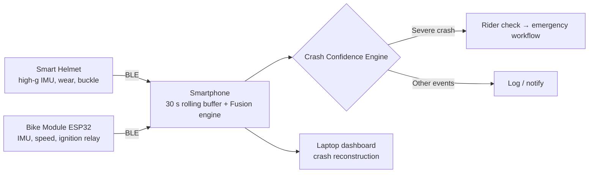

# RYVORA

**Intelligence that protects every ride.** Helmet. Bike. Phone. One intelligent safety system.

RYVORA is an AI-powered rider-safety ecosystem: a smart helmet, a motorcycle sensor module and a smartphone fuse their sensors to tell a real crash from a pothole, a hard brake, a dropped helmet or a parked-bike fall, and escalate only when the rider cannot respond.

> **Prototype.** All hardware data is simulated. Emergency communication is *demonstrated*, not performed. No medical diagnosis.

## Problem → Solution
- Single-sensor crash detection fires on any high impact (a dropped helmet looks like a crash).
- RYVORA's **Crash Confidence Engine** (`lib/engine/crash-confidence.ts`) matches each event against per-class signatures across 8 signals from 3 devices, and reports a confidence that drops when signals are missing or ambiguous.
- The helmet is **not a single point of failure**: the phone keeps a rolling pre-crash buffer, so phone + bike finish verification if the helmet dies on impact.

## Architecture

- `lib/types` — `HelmetTelemetry`, `BikeTelemetry`, `PhoneTelemetry`, `SystemSnapshot`, `FusionInput`, `RideEvent`.
- `lib/simulation` — `TelemetrySource` adapter interface + `SimulatedTelemetrySource`, deterministic scenarios.
- `lib/engine` — pure, unit-tested fusion engine and pre-ride readiness rules.
- `components/*` — presentational components fed by those interfaces (reused by the app and Jury Mode).

## Routes
| Route | Purpose |
|---|---|
| `/` | Landing |
| `/dashboard` | Rider home, system status, START RIDE |
| `/precheck` | Animated pre-ride check → simulated start permission |
| `/ride` | Live ride + simulated events |
| `/safety` | Crash Confidence Engine, false-positive demo, fail-safe |
| `/reconstruction` | Desktop black box & crash reconstruction |
| `/health` | Hardware diagnostics |
| `/history`, `/history/[id]` | Ride/event history |
| `/profile` | Rider + emergency contacts (demo) |
| `/jury-demo` | Automated 9-step jury presentation |

## Development
```bash
npm install
npm run dev        # http://localhost:3000
npm run lint
npm run typecheck
npm test           # engine unit tests (vitest)
npm run build && npm start
```
Environment: copy `.env.example` → `.env.local` (no secrets required).

## Deployment (Vercel)
```bash
npm i -g vercel
vercel login
vercel          # preview
vercel --prod   # production
```

## Jury demo
Open `/jury-demo` → **Start Demo** (Space), **Skip Step** (→), **Reset Demo** (R). See `DEMO_SCRIPT.md` and `JURY_DEMO_CHECKLIST.md`.

## Future hardware integration
Implement `TelemetrySource` (`lib/simulation/telemetry-source.ts`) for Web Bluetooth / Android native bridge; the ESP32 bike module streams IMU + speed over BLE GATT notify and drives the ignition-enable relay.

## Screenshots
_Add screenshots of mobile home, safety engine, jury demo and reconstruction here._
