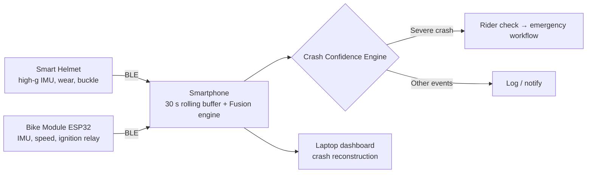

# RYVORA

**Intelligence that protects every ride.** Helmet. Bike. Phone. One intelligent safety system.

RYVORA is an AI-powered rider-safety ecosystem: a smart helmet, a motorcycle sensor module and a smartphone fuse their sensors to tell a real crash from a pothole, a hard brake, a dropped helmet or a parked-bike fall, and escalate only when the rider cannot respond.

> **Prototype.** All hardware data is simulated. Emergency communication is *demonstrated*, not performed. No medical diagnosis.

## Problem → Solution
- Single-sensor crash detection fires on any high impact (a dropped helmet looks like a crash).
- RYVORA's **Crash Confidence Engine** (`lib/engine/crash-confidence.ts`) matches each event against per-class signatures across 8 signals from 3 devices, and reports a confidence that drops when signals are missing or ambiguous.
- The helmet is **not a single point of failure**: the phone keeps a rolling pre-crash buffer, so phone + bike finish verification if the helmet dies on impact.

## Architecture

- `lib/types` — `HelmetTelemetry`, `BikeTelemetry`, `PhoneTelemetry`, `SystemSnapshot`, `FusionInput`, `RideEvent`.
- `lib/simulation` — `TelemetrySource` adapter interface, `SimulatedTelemetrySource`, the `WebBluetoothTelemetrySource` stub, the `createTelemetrySource()` factory and deterministic scenarios.
- `lib/engine` — pure, unit-tested fusion engine, pre-ride readiness rules and the plain-language key-signal readout.
- `lib/jury` — Jury Mode as a pure state machine (`demoReducer`) plus per-step timing, so every frame is a function of elapsed time.
- `components/*` — presentational components fed by those interfaces (reused by the app and Jury Mode).

## Features
- **Crash Confidence Engine** — 8 signals from 3 devices, per-class signatures (severe crash, minor fall, helmet drop, pothole, hard brake, parked-bike fall). A helmet drop scores 98 % *helmet drop* with no emergency; a severe crash scores 96 % and starts the rider check.
- **Pre-ride readiness** — essential checks (helmet linked, worn, buckled; bike module linked; phone sensors) gate a *simulated* start permission. IMU faults, poor link latency and lost GPS are advisory: the ride is allowed with degraded coverage.
- **Rider check → emergency workflow** — "Are you okay?" countdown, then a *demonstrated* workflow (location attached → emergency contact alerted → incident data prepared). The countdown length and automatic escalation are set in Profile → Safety settings (stored on the device only). If GPS is off, the last known fix and its age are attached instead.
- **Fail-safe** — the phone keeps a 30 s rolling pre-crash buffer, so phone + bike finish verification if the helmet is destroyed (96 % → 89 % with 7 of 8 signals in the Safety lab).
- **Digital black box & crash reconstruction** — synchronised speed / acceleration / rotation charts, a device-coloured incident timeline, signal contribution table, rule-based explanation and a downloadable JSON incident package (marked `simulated: true`).
- **Ride history** — rides and safety events with filters, IST day grouping, per-event evidence, the engine's response, and sensor charts; every figure is computed from `data/rides.ts` through the engine.
- **Hardware health (`/health`)** — per-device diagnostic cards (helmet, bike module, phone, AI safety engine, hardware adapter) with battery, firmware, link latency (Excellent / Good / Fair / Poor), last-packet age ("Link stale" after 3 s, "Link lost" with the last-seen time), plain-language warnings (e.g. *HELMET IMU ERROR — Crash detection capability may be degraded. Phone and bike verification remain active.*), fault-injection switches for the simulator, and honest Web Bluetooth detection.

### Hardware adapters (`NEXT_PUBLIC_TELEMETRY_SOURCE`)
The UI only ever talks to a `TelemetrySource` (`lib/simulation/telemetry-source.ts`). `createTelemetrySource()` (`lib/simulation/create-source.ts`) picks the implementation from `NEXT_PUBLIC_TELEMETRY_SOURCE`, which Next inlines at build time:

| Value | Source | Behaviour |
|---|---|---|
| `simulated` (default, also any unknown value) | `SimulatedTelemetrySource` | Deterministic simulated helmet, bike module and phone. Simulator panel and fault injection enabled. |
| `web-bluetooth` | `WebBluetoothTelemetrySource` (stub) | Detects Web Bluetooth support and radio availability only. GATT pairing is not implemented yet, so every device reads *Offline / Unavailable*, readiness is blocked and the simulator controls are disabled. Never throws. |
| `native-bridge` | — | Planned (Android app → WebView bridge). Currently falls back to the simulator. |

Placeholder GATT UUIDs live in `RYVORA_GATT` (`lib/simulation/web-bluetooth-source.ts`, marked `TODO(hardware)`). Start permission is read/notify only — the browser never writes ignition control.

## Routes
| Route | Purpose |
|---|---|
| `/` | Landing — hero with live verification card, ecosystem flow, Prevent / Verify / Respond, helmet-drop vs real-crash comparison, fail-safe |
| `/dashboard` | Rider home, system status, START RIDE |
| `/precheck` | Animated pre-ride check → simulated start permission |
| `/ride` | Live ride + simulated events (rider check uses your safety settings) |
| `/safety` | Safety lab — scenario picker, key signals, Crash Confidence Engine, fail-safe toggle |
| `/reconstruction` | Desktop black box & crash reconstruction, JSON incident package download |
| `/health` | Hardware health — device diagnostics, warnings, fault injection, adapter status |
| `/history` | Ride & safety-event history with filters and summary |
| `/history/[id]` | Ride or event detail (statically generated for every id; unknown ids → 404) |
| `/profile` | Rider identity, emergency contacts (demo), notes, paired devices, safety settings |
| `/jury-demo` | Automated 9-step jury presentation + finale |

## Development
```bash
npm install
npm run dev        # http://localhost:3000
npm run lint
npm run typecheck
npm test           # vitest
npm run build && npm start
```
Environment: copy `.env.example` → `.env.local` (no secrets required). See *Hardware adapters* above for `NEXT_PUBLIC_TELEMETRY_SOURCE`.

## Testing
`npm test` runs [Vitest](https://vitest.dev) in a Node environment over `lib/**/*.test.{ts,tsx}` and `components/**/*.test.{ts,tsx}`:
- **Engine** — crash confidence per scenario (helmet drop 98 % with no emergency, severe crash 96 % with escalation, helmet-less fallback), readiness rules (blocked vs degraded, unique check ids, all-null snapshots), key-signal rows.
- **Simulation & adapters** — device-state snapshots for every fault, simulated source timers (1 Hz idle / 8 Hz riding, cleanup, re-subscribe), the Web Bluetooth stub, the source factory and link-quality helpers.
- **Jury Mode** — every state-machine transition, per-step frames and narration, playback paths and scales.
- **History, profile, reconstruction** — history model (summary, IST grouping, ride stats with missing values), safety-settings parsing, incident model and the JSON package.
- **Server-render smoke tests** — landing page, Safety lab, fail-safe stages, reconstruction view, emergency workflow, rider check and incident overlay accessibility (no assertive per-second announcements, modal semantics).

## Deployment (Vercel)
```bash
npm i -g vercel
vercel login
vercel          # preview
vercel --prod   # production
```

## Jury demo
Open `/jury-demo` and press **Start**. Nine steps (≈ 2:10) play automatically: pre-ride failure → helmet worn & buckled → ride starts → helmet drop (no emergency) → severe crash → "Are you okay?" → emergency workflow → helmet connection lost (fail-safe) → desktop crash reconstruction, then the finale.

| Control | Button | Keyboard |
|---|---|---|
| Start / Pause / Resume / Replay | Start · Pause · Resume · Replay | `Space` |
| Next step | Skip Step | `→` |
| Previous step | Prev | `←` |
| Reset to the intro | Reset Demo | `R` |
| Jump to any step | Step rail | `Tab` + `Enter` |

Shortcuts are ignored while typing, on key repeat and with modifier keys; `Space` on a focused button just presses that button. During step 6, **I'M OKAY** cancels the alert and **NEED HELP** jumps to the emergency workflow. See `DEMO_SCRIPT.md` and `JURY_DEMO_CHECKLIST.md`.

## Future hardware integration
Complete `WebBluetoothTelemetrySource` (GATT pairing from a user gesture, notify subscriptions on the `RYVORA_GATT` services) or add a native-bridge `TelemetrySource`; nothing above the adapter changes. The ESP32 bike module streams IMU + speed over BLE GATT notify and drives its ignition-enable relay locally; the phone only reads start permission.

## Honest prototype disclaimer
- All helmet, bike-module and phone sensor data in this build is **simulated**.
- Emergency communication is a **demonstrated / simulated workflow**: no SMS, call, hospital or emergency service is ever contacted, and hospital integration is not part of this prototype.
- The browser does **not** control the motorcycle; start permission is shown, not enforced.
- RYVORA estimates crash likelihood from motion data. It does **not** make medical assessments or diagnoses.

## Screenshots
_Add screenshots of mobile home, safety engine, jury demo and reconstruction here._
